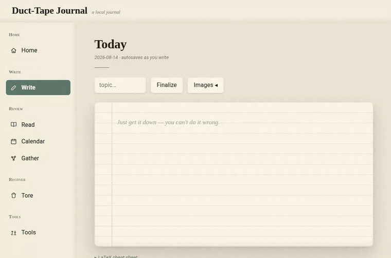
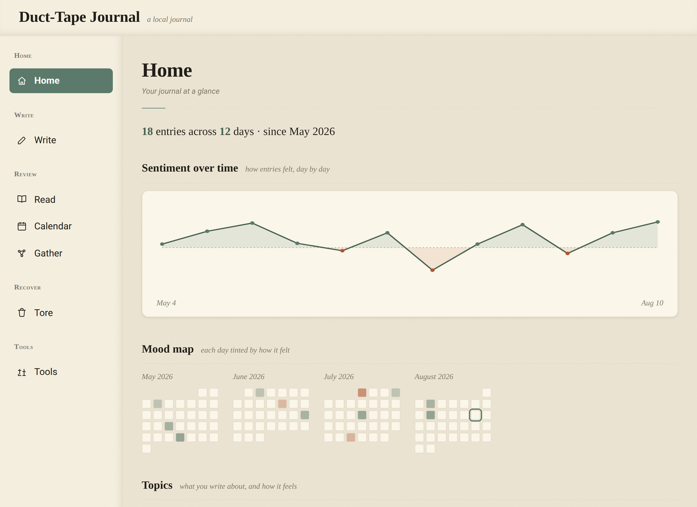
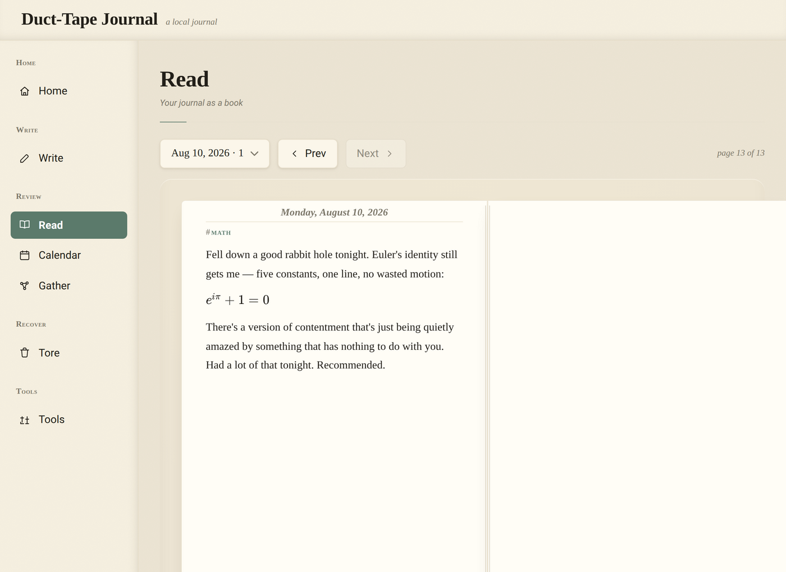
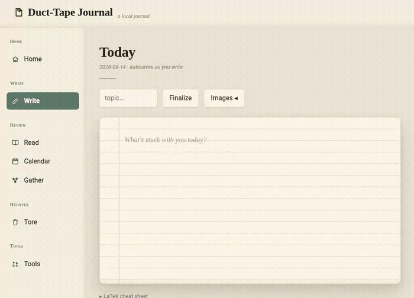

# Duct-Tape Journal

A local journal that stays out of your way. It is a folder of markdown files with a small app on top. You open it, write a line or two, and save. That is the whole loop.



## The idea

Most journaling apps ask you to care about the app. Pick a theme, keep a streak, decorate the page. This one tries to do the opposite. It boots straight into a blank page so you can start typing, and committing an entry is one keystroke. There is no streak counter, no stickers, and nothing to fiddle with before you write.

Everything lives on your machine. Your entries are plain markdown in a `diary/` folder that you own. If you stopped using this app tomorrow, the files would still open in any text editor.

The charts and summaries are a nice add-on, not the point. Write first. Look at the trends later if you feel like it.

## Try it

You need Node 20 or newer.

```bash
git clone <this-repo>
cd <the-folder-it-cloned-into>
npm install
npm run demo
```

`npm run demo` seeds a small sample journal into a throwaway `diary.demo/` folder and starts the app against it, so you can click around without setting anything up. It does not touch a real `diary/` folder. Open the URL it prints (usually http://localhost:5173) and you are in. When you are done, `npm run demo:clean` removes the sample.

## What it does

- **Write.** A markdown editor that autosaves as you type. Commit an entry with the button or with Cmd/Ctrl+Enter. You can paste or drop in images, and it renders inline math with `$...$`.
- **Read.** Your entries laid out like a book you can page through, one day at a time.
- **Calendar.** A month grid where each day is tinted by how it felt.
- **Gather.** Browse entries by their topic word, or make a "concept" (an idea plus a few keywords) that collects every entry mentioning it.
- **Home.** A quiet overview: a mood line over time, a heatmap, and how each topic tends to feel.
- **Tore.** Nothing is ever really deleted. Deleted entries and images land here, and you can put them back.

Each entry also gets a sentiment score when you save it. That runs on a small model on your own machine, so there is no API key and nothing leaves your computer.

## A look around

The Home tab, your entries over time:



Read mode lays the days out like a book:



## Recaps that run on your machine

Once you have a pile of entries about the same thing, it is a lot to reread. So Gather has a Summarize button. Click it and you get a short recap of that group of entries, plus a few highlighted lines pulled straight from what you wrote.



Here is the part worth saying twice: the model runs on your own computer. There is no API key to set up, no account, no sending your journal off to someone else's server to be summarized. The first click downloads a small model once, and after that it works offline like the rest of the app. If the model is not available, you still get the highlighted lines, since those need no model at all.

## Local-first, plainly

Your journal is a folder of markdown files. No account, no cloud, no sign-in. The sentiment and recap models run offline on your machine. The app is a convenient way to read and search those files, but the files are the real thing, and they are yours.

## How it is built

- Front end: Vite and React, plain JavaScript (no TypeScript).
- Back end: a small Express server that owns the `diary/` folder and handles saving, deleting, and restoring.
- On-device models: sentiment and text summaries via Transformers.js, cached locally after the first run.

The app is three parts that only share the `diary/` folder: the editor, the reader, and the analysis views. None of them imports the others, so any one can be changed on its own.

## Running your own journal

```bash
npm install
npm start
```

`npm start` runs the front end and the server together against your own `diary/` folder in the project root. That folder is gitignored, so your entries are never committed.

Other useful commands:

- `npm test` runs the test suite, which covers the save, delete, and restore behavior (an entry is never overwritten, deletes are recoverable, and so on).
- `npm run lint` and `npm run format` check and format the code.

## Using it from your phone

There is no mobile app, but you do not really need one. Run:

```bash
npm run start:host
```

That exposes the app on your local network. On your phone, open `http://<your-computer-ip>:5173` (the terminal prints the address), and you are writing on your phone against the journal that lives on your computer. Same files, no sync, nothing in the cloud.

If you want to reach it when you are not on the same network, the easy way is Tailscale. Install it on both your computer and your phone, sign into the same account, and they join a small private network of their own. Then use the computer's Tailscale address in place of the local IP. Your journal stays on your machine the whole time. Tailscale just gives your phone a private door to it.

This is a nice-to-have, not a setup step. If you only ever use it on one machine, ignore this whole section.

## Status

This is a personal project. The reading views are deliberately plain for now. It does what is described above and not more, and there are no promises about what comes next.
